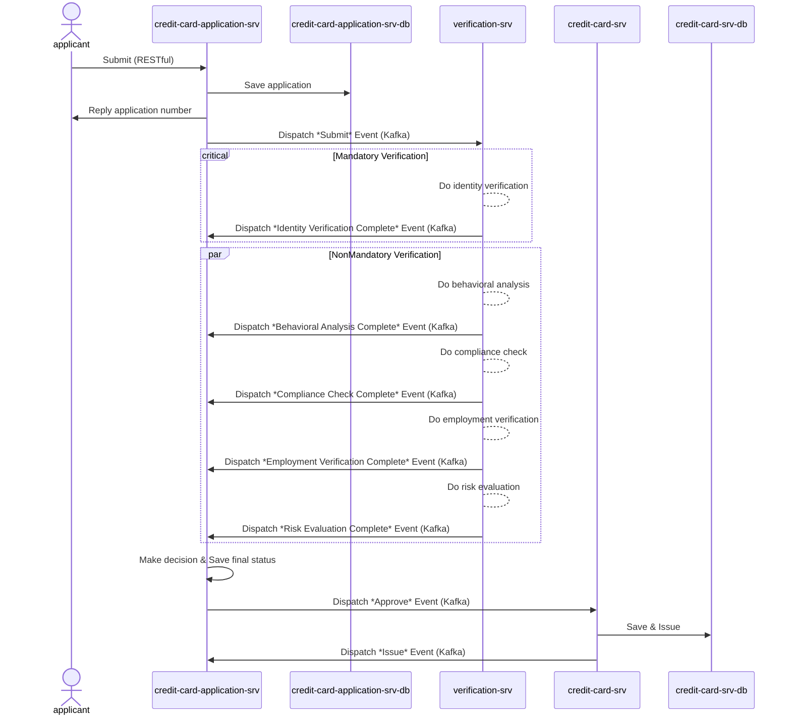

# quick-credit

Quick Credit is a proof-of-concept system for a credit card onboarding workflow using Quarkus

## Anatomy

The application is composed of the following components:

#### credit-card-application-srv

The primary _producer_ application receive requests from the user (via HTTP) and sends _credit card
application request_ to the Kafka broker.
Two main components compose the application:

* `CreditCardApplicationService` handles the life-cycle of the onboarding and stores the requests
  into H2 database. It also consumes the events from `verification-srv` for determining the status
  of the onboarding.
* `DecisionService` decides the final status of the onboarding based on the downstream services

#### credit-card-srv

The _consumer_ application receives approved credit card application and issues a credit card.
The application has one main class:

* `CreditCardIssueProcessor` consumes events ids from the `credit-card-application-srv` and proceed card issuing process
 
#### verification-srv

The _consumer_ application receives verification request from upstream (i.e. `credit-card-application-srv`) and connects with 3rd party provider for verification.
The application has a few classes:

* `BehavioralAnalysisService` _MOCK_ handles analysis of spending habits and payment
  history to predict future credit behavior 
* `ComplianceCheckService`  _MOCK_ verifies that requests comply with local and
  international financial regulations, including anti-money laundering (AML) and
  know your customer (KYC) standards. (Blacklist Check)
* `EmploymentVerificationService` _MOCK_ verifies the employment details of credit card
  applicants to ensure they have a stable and reliable source of income, which is
  a significant indicator of their ability to meet credit obligations.
* `IdentityVerificationService` _MOCK_ ensures the accuracy and authenticity of
 applicant personal information.
* `RiskEvaluationService` _MOCK_ evaluates each applicant’s financial history to determine
  creditworthiness
* `CreditCardVerificationProcessor` orchestrates the above providers and dispatches relevant events

## Sequence Diagram (Happy Case)



## API
All RESTful APIs are sitting on `credit-card-application-srv`, the rest of the microservices are connected with Kafka. Please see Postman below .

| API                                                  | Method | Description             | Fields                                                                                                                                                  |
|------------------------------------------------------|--------|-------------------------|---------------------------------------------------------------------------------------------------------------------------------------------------------|
| credit-card-application-resource                     | POST   | Submit an application   | emirateIdNumber<br/>name<br/>mobileNumber<br/>nationality<br/>address<br/>income<br/>currentEmployer<br/>employmentStatus<br/>requestedCreditLimit<br/>bankStatement |
| credit-card-application-resource/{applicationNumber} | GET    | Enquiry the application | -                                                                                                                                                       |

To run the application in Docker, first make sure that both services are built:
```bash
mvn package
```

Then launch Docker Compose:

```bash
docker-compose up
```

This will create a single-node Kafka cluster and launch both applications.


## Play
- Please use the [collection of Postman](https://github.com/bugbug0102/quick-credit/blob/61fee9700a1606eadabb35ba820f3fd8886205e1/credit-card-application.postman_collection.json) under the root folder
- Video: [YouTube](https://youtu.be/8nbF-rI4NR8)

## TODO
- File Handling such as AV scanning and buckets. A `Thread.sleep` was added currently for pretending a duration of file analysis 
- Silent push. A `webhook` was installed in the `application.properties` for showing an event back to public once the card is issued 
- RDS/NoSQL database. `H2` is used in everywhere. Supposedly, NoSQL is considered for customer facing data input  


